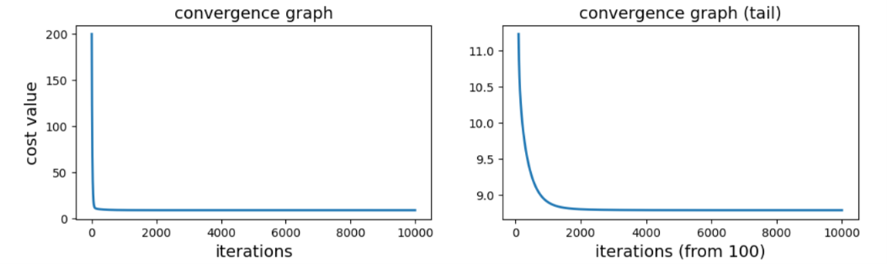
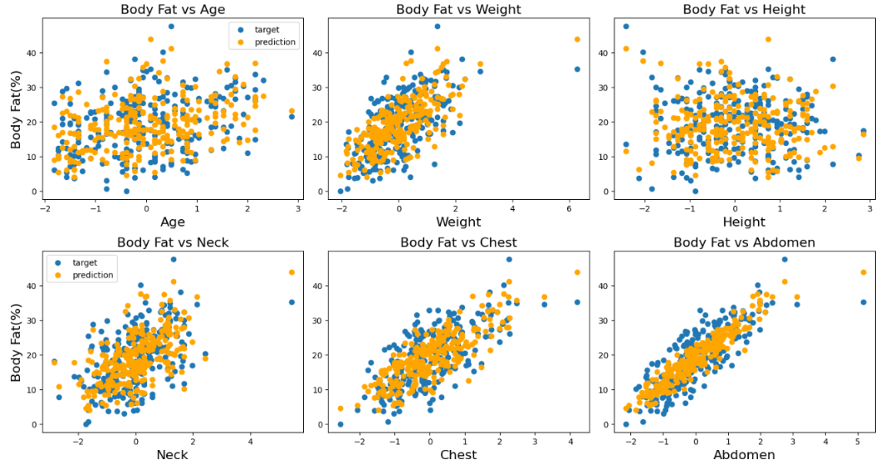
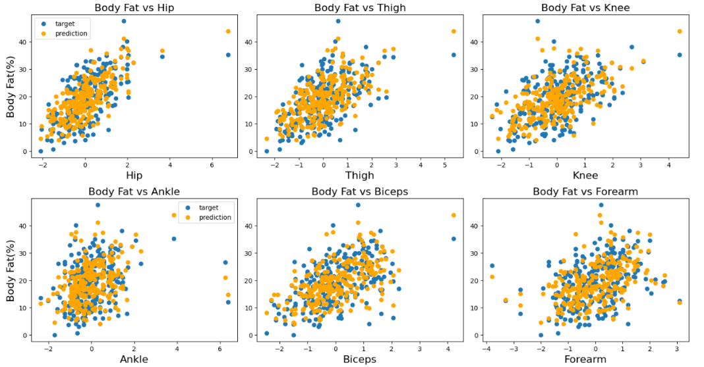
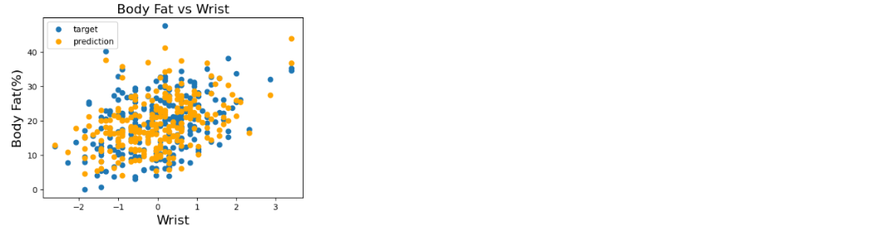

# 📉 Custom Gradient Descent for Multiple Linear Regression

An custom implementation of Batch Gradient for Multiple Linear Regression Descent using Python and NumPy. Running the custom algorithm predict human body fat percentage based on multiple body parts measurement and evaluate the custom gradient descent perfomance.

*👉 [Click here to view the Jupyter Notebook to see the custom algorithm predicting body fat](https://nbviewer.org/github/baokowjbu-oss/custom-gradient-descent-multiple-regression/blob/main/notebook/customBGD_bodyfat.ipynb)*

*👉 [Click here to see the custom implementation of batch gradient descent for multiple linear regression](https://github.com/baokowjbu-oss/custom-gradient-descent-multiple-regression/blob/main/src/bgd_regressor.py)*

## 💡 Key Feature

- Instead of importing scikit-learn and calling .fit(), I built the batch gradient descent algorithm manually. This project help me to apply my understanding of matrix multiplication, cost function, derivative and gradient descent to implement a batch gradient descent for multiple linear regression, using fully vectorized matrix multiplication to speed up the algorithm. 
- I use my own custom implemented batch gradient descent to run multiple linear regression on the body fat datasets, to predict a person body fat based on multiple body parts measurements. The model succesfully ran and achieve great result (results are in the Model Performance section).
- In my notebook i also use feature scaling to speed up the gradient descent and visualization to analyze the data and demonstrate how well the model run.

## 📊 Model Performance

- The custom gradient descent successfully ran and converged

- The algorithm also achieve good predictive results

- $R^2$ Score: 0.7463 (Explains ~75% of human body variance using a tape measure)

- Mean Absolute Error (MAE): 3.45% (On average, predictions are within 3.5% of actual body fat)

- Root Mean Squared Error (RMSE): 4.19%

## 🛠️ Tech Stack

- Python

- NumPy (Linear Algebra & Optimization)

- Pyplot (Data Visualization)

- Pandas (Data Cleaning)

## Source

The data were generously supplied by Dr. A. Garth Fisher who gave permission to freely distribute the data and use for non-commercial purposes.

Roger W. Johnson

Department of Mathematics & Computer Science

South Dakota School of Mines & Technology

501 East St. Joseph Street

Rapid City, SD 57701

Email address: rwjohnso@silver.sdsmt.edu

Web address: http://silver.sdsmt.edu/~rwjohnso

## References

Bailey, Covert (1994). Smart Exercise: Burning Fat, Getting Fit, Houghton-Mifflin Co., Boston, pp. 179-186.

Behnke, A.R. and Wilmore, J.H. (1974). *Evaluation and Regulation of Body Build and Composition*, Prentice-Hall, Englewood Cliffs, N.J.

Siri, W.E. (1956), "Gross composition of the body", in *Advances in Biological and Medical Physics*, vol. IV, edited by J.H. Lawrence and C.A. Tobias, Academic Press, Inc., New York.

Katch, Frank and McArdle, William (1977). *Nutrition, Weight Control, and Exercise*, Houghton Mifflin Co., Boston.

Wilmore, Jack (1976). *Athletic Training and Physical Fitness: Physiological Principles of the Conditioning Process*, Allyn and Bacon, Inc., Boston.